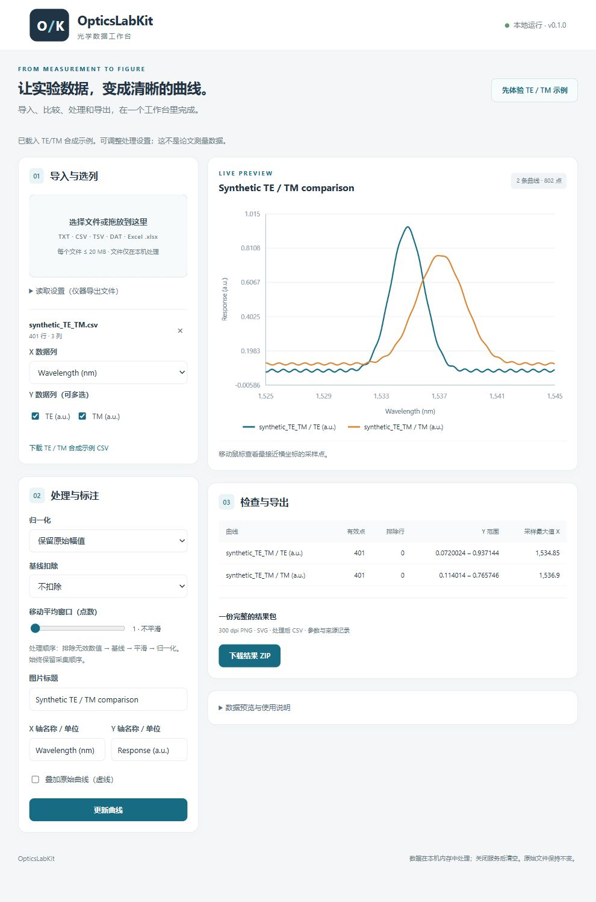

# OpticsLabKit

[](https://github.com/SoftBread1217/OpticsLabKit/actions/workflows/ci.yml)
[](LICENSE)

**Prepare optical scans and repeated measurements for reproducible figures and Origin.**

[中文使用说明](docs/quickstart_zh.md) · [Releases](https://github.com/SoftBread1217/OpticsLabKit/releases) · [Report an issue](https://github.com/SoftBread1217/OpticsLabKit/issues)

OpticsLabKit helps turn instrument TXT/CSV files and Excel worksheets into comparison
figures without writing a new script for every experiment. Choose the X/Y columns,
label TE/TM pairs, separate scan branches, summarize repeated runs, and download a result bundle.
The browser interface is in Chinese. All processing runs on your computer.

This is a focused preparation tool, **not an Origin replacement**. Use it to check and organize
instrument exports, save a repeatable comparison, and hand independent X/Y columns to Origin
for advanced fitting or final layout. Figure dimensions are user-controlled; journal compliance
still needs a check against the target publication's requirements.

v0.2.0 implements the three workflow improvements below. It remains a small, focused
workbench: please validate processing choices against your experiment before using results.



The image above is the v0.1.0 foundation interface. For v0.2.0 and its three
examples, follow the [ten-minute walkthrough](docs/v0.2.0_tryout_zh.md).

## Try it

Python 3.10 or newer:

```bash
git clone https://github.com/SoftBread1217/OpticsLabKit.git
cd OpticsLabKit
python -m venv .venv
# Windows PowerShell
.venv\Scripts\Activate.ps1
python -m pip install -e .
python -m opticslabkit serve
```

On macOS/Linux, activate the environment with `source .venv/bin/activate`.

Open **http://127.0.0.1:8766** and click **先体验 TE / TM 示例**.
On Windows, `launch.ps1` starts the app using the local virtual environment, or your
default Python if no environment exists. Dependencies must already be installed.
You can also double-click `start.cmd` and then open the local address.

The example is a deterministic synthetic spectrum, not experimental or paper data.
Drag in your own file when ready. Use the reading settings for metadata lines,
headerless files, separators, and decimal commas. XLSX workbooks expose a sheet selector.

## What v0.2.0 adds

- **Export-matched preview**: the displayed SVG uses the exact PNG/SVG/PDF renderer.
  Physical dimensions (mm), fonts and sizes (pt), ticks, ranges, linear/log axes, legends,
  per-curve colors, line styles, and markers are adjustable. Single/double-column presets
  are starting points, not a guarantee of compliance with any journal.
- **Optical workflow**: editable labels, TE/TM annotations and explicit experimental groups;
  monotonic scan-branch detection and selection **before** baseline/smoothing/normalization.
  Turning points are shared, acquisition order is retained, and cross-turn smoothing is rejected.
- **Repeated measurements**: opt-in mean ± sample SD for matching group/polarization,
  after the user confirms common units, conditions and independent repeats. Strict monotonic,
  duplicate-free, same-direction runs only. Linear interpolation uses the first run's grid
  in the common overlap; no extrapolation. SD uses `ddof=1`, not SEM or a confidence interval.
- **Continue editing**: session save/load (`.olksession.json`) retains original file bytes,
  parser settings, selected columns, groups, styles and processing. Sessions contain private
  measurement data; review before sharing. Original files total at most 20 MB per session file.
- **Origin and Python handoff**: `origin_xy.csv` provides independent X/Y column pairs
  (assign their roles in Origin); `redraw.py` plus `plot_style.py` redraw PNG/SVG/PDF without
  installing OpticsLabKit. Edit `manifest.json` to change figure settings. Fonts/software
  versions can still affect layout. The script does not overwrite an existing redraw.
- Three built-in synthetic examples: TE/TM, forward/return scan, and repeated measurements.

## Foundation features

- TXT/CSV/TSV/DAT import: UTF-8/BOM, UTF-16 BOM, GB18030; comma, tab, whitespace, semicolon.
- XLSX import, worksheet selection, editable header and skipped-row settings.
- Select multiple Y columns and overlay curves from multiple files.
- Retain acquisition order, including descending or returning scans and duplicate X values.
- Pairwise removal of invalid X/Y rows, with a visible count.
- Optional minimum or endpoint-linear baseline subtraction, moving average,
  Min-Max or maximum-absolute normalization.
- Raw/processed overlay, range summary, sampled maximum position.
- Download PNG (150/300/600 dpi), editable-text SVG, vector PDF, processed CSVs,
  repeat statistics when requested, and a JSON provenance record.
- Python API and CLI for repeatable use.

Exports record source filenames, SHA-256 hashes, parsing options, selected columns,
processing order, software versions, dropped-row counts, and warnings. They do not
include copies of the original files. **Saved sessions do include the original files.**
CSV `source_data_row` refers to the parsed table, not the original file line.

## CLI

```bash
python -m opticslabkit inspect experiment.csv
python -m opticslabkit process experiment.csv --x "Wavelength (nm)" --y "TE" --y "TM" --normalization minmax --smoothing 5 --x-label "Wavelength (nm)" --y-label "Normalized response" --output outputs/comparison.zip
python -m opticslabkit demo --output outputs/demo.zip
# Optional: branch ID is zero-based; all is the default. Choose dimensions explicitly.
python -m opticslabkit process scan.csv --x input --y response --branch 0 --width-mm 85 --height-mm 65 --font-size 8 --output outputs/branch.zip
```

`process` and `demo` require a new output filename and do not overwrite an existing ZIP.

## Python API

```python
from pathlib import Path
from opticslabkit.data import read_data
from opticslabkit.processing import process_curve
from opticslabkit.export import export_bundle

path = Path("experiment.csv")
dataset = read_data(path.name, path.read_bytes())
print(dataset.describe())
curve = process_curve(dataset, "wavelength_nm", "transmission", normalization="minmax")
bundle = export_bundle([curve], {
    "title": "Transmission", "x_label": "Wavelength (nm)",
    "y_label": "Normalized transmission", "show_raw": False,
})
Path("results.zip").write_bytes(bundle)
```

## Interpretation

Units are user-supplied. Values are never converted between linear power and dB automatically.
Individual normalization removes absolute intensity ratios between TE/TM curves.
Moving averages use point counts and edge-value padding, not a fixed wavelength width.
Endpoint-linear baseline assumes the first and last points describe the background.
Sample maxima are not fitted peak positions or FWHM. Branch direction describes X increasing
or decreasing, not sweep time or physical state. Plateaus remain intact; no noise threshold is
assumed when finding turning points. Tiny X reversals therefore create branches too.
TE/TM pairing checks counts within explicit groups; it does not compute intensity ratios.
Different conditions must not be combined just because filenames look similar.
Individually normalized repeat SD describes normalized shapes, not absolute measurement error.

This version supports `.xlsx`, not `.xls`, and static figures, not instrument control.
Maximums: 20 MB per file, 200,000 rows, 40 imports per session, 12 curves per comparison.
Uploads stay in server memory until the process stops. No network API, CDN, analytics,
or remote upload is used. The service binds to `127.0.0.1` only.

## Development

```bash
python -m pip install -e ".[dev]"
python -m pytest
python -m ruff check .
```

See [中文入门](docs/quickstart_zh.md) and [Roadmap](ROADMAP.md).
License: MIT.
